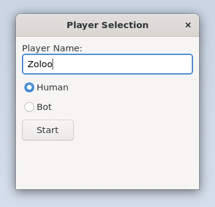

# CPPND: Capstone Snake Game Example

This is the fifth and final project by Enkhzol Dovdon as a trainee in the Udacity C++ Nanodegree Program.

This is a starter repo for the Capstone project in the [Udacity C++ Nanodegree Program](https://www.udacity.com/course/c-plus-plus-nanodegree--nd213). The code for this repo was inspired by [this](https://codereview.stackexchange.com/questions/212296/snake-game-in-c-with-sdl) excellent StackOverflow post and set of responses.

*Udacity:* The Capstone Project gives you a chance to integrate what you've learned throughout this program. This project will become an important part of your portfolio to share with current and future colleagues and employers.

*Udacity:* In this project, you can build your own C++ application or extend this Snake game, following the principles you have learned throughout this Nanodegree Program. This project will demonstrate that you can independently create applications using a wide range of C++ features.

## Dependencies for Running Locally
* cmake >= 3.7
  * All OSes: [click here for installation instructions](https://cmake.org/install/)
* make >= 4.1 (Linux, Mac), 3.81 (Windows)
  * Linux: make is installed by default on most Linux distros
  * Mac: [install Xcode command line tools to get make](https://developer.apple.com/xcode/features/)
  * Windows: [Click here for installation instructions](http://gnuwin32.sourceforge.net/packages/make.htm)
* SDL2 >= 2.0
  * All installation instructions can be found [here](https://wiki.libsdl.org/Installation)
  >Note that for Linux, an `apt` or `apt-get` installation is preferred to building from source. 
  * Easy installation in Linux:
  * sudo apt-get install libsdl2-dev
* wxWidgets >= 3.0
  * Linux: `sudo apt-get install libwxgtk3.0-gtk3-dev libwxgtk3.0-gtk3-0v5`. If you are facing unmet dependency issues, refer to the [official page](https://wiki.codelite.org/pmwiki.php/Main/WxWidgets30Binaries#toc2) for installing the unmet dependencies.
  * Mac: There is a [homebrew installation available](https://formulae.brew.sh/formula/wxmac).
  * Installation instructions can be found [here](https://wiki.wxwidgets.org/Install). Some version numbers may need to be changed in instructions to install v3.0 or greater.
* gcc/g++ >= 5.4
  * Linux: gcc / g++ is installed by default on most Linux distros
  * Mac: same deal as make - [install Xcode command line tools](https://developer.apple.com/xcode/features/)
  * Windows: recommend using [MinGW](http://www.mingw.org/)

## Basic Build Instructions

1. Clone this repo.
2. Make a build directory in the top level directory: `mkdir build && cd build`
3. Compile: `cmake .. && make`
4. Run it: `./SnakeGame`.

## CC Attribution-ShareAlike 4.0 International

Shield: [![CC BY-SA 4.0][cc-by-sa-shield]][cc-by-sa]

This work is licensed under a
[Creative Commons Attribution-ShareAlike 4.0 International License][cc-by-sa].

[![CC BY-SA 4.0][cc-by-sa-image]][cc-by-sa]

[cc-by-sa]: http://creativecommons.org/licenses/by-sa/4.0/
[cc-by-sa-image]: https://licensebuttons.net/l/by-sa/4.0/88x31.png
[cc-by-sa-shield]: https://img.shields.io/badge/License-CC%20BY--SA%204.0-lightgrey.svg

## All Rubric Points REQUIRED and Addressed by the trainee
### Loops, Functions, I/O - meet at least 2 criteria 
* The project demonstrates an understanding of C++ functions and control structures.
  * A variety of control structures are added to the project. The project code is clearly organized into functions.
  *Addressed:* Several control structures are added.
* The project reads data from a file and process the data, or the program writes data to a file.
  * The project reads data from an external file or writes data to a file as part of the necessary operation of the program.
  * *Addressed:* It writes/reads a human player history as {name, score} to/form build/players.txt
* The project accepts user input and processes the input.
  * In addition to controlling the snake, the game can also receive new types of input from the player.
  * *Addressed:* The window has been added where players can enter their names and choose to either play or let a bot start the game.
  * 
* The project uses data structures and immutable variables.
  * The project uses arrays or vectors and uses constant variables.
  * *Addressed:* The following vector and constant variables are used in the Game class: 
  std::shared_ptr<std::vector<Human>> prev_currunt_players;
  static const std::string players_filename;

### Object Oriented Programming - meet at least 3 criteria
* One or more classes are added to the project with appropriate access specifiers for class members.
  * Classes are organized with attributes to hold data and methods to perform tasks. All class data members are explicitly specified as public, protected, or private. Member data that is subject to an invariant is hidden from the user and accessed via member methods.
  * *Addressed:* The Player, Human:Player, and Bot:Player classes have been added, each with their appropriate members.
* Class constructors utilize member initialization lists.
  * All class members that are set to argument values are initialized through member initialization lists.
  * *Addressed:* The constructors of the newly added classes initialize their member variables.
* Classes abstract implementation details from their interfaces.
  * All class member functions document their effects, either through function names, comments, or formal documentation. Member functions do not change the program state in undocumented ways.
* Overloaded functions allow the same function to operate on different parameters.
  * One function is overloaded with different signatures for the same function name.
  * *Addressed:* The "HandleInput" function is overridden in the Controller class.
* Classes follow an appropriate inheritance hierarchy with virtual and override functions.
  * Inheritance hierarchies are logical. One member function in an inherited class overrides a virtual base class member function.
  * *Addressed:* The virtual methods are defined in the Player base class.
* Templates generalize functions or classes in the project.
  * One function or class is declared with a template that allows it to accept a generic parameter.

### Memory Management - meet at least 3 criteria
* The project makes use of references in function declarations.
  * At least two variables are defined as references, or two functions use pass-by-reference in the project code.
  * *Addressed:* The following functions and variables utilize pass-by-reference:
    * void RandomAsteroid(std::promise<std::string> &&prms, Game *gm, bool &running, std::string message_to_thread);
    * Human Game::FindAndAddCurrentPlayerHistory(const string& player_name)
    * void Controller::HandleInput(*bool &running*, Snake &snake, *Bot &bot_player*, std::thread &th1);
    * for (auto &human : *prev_currunt_players)
    * humans.emplace_back(human);

* The project uses destructors appropriately.
  * At least one class that uses unmanaged dynamically allocated memory, along with any class that otherwise needs to modify state upon the termination of an object, uses a destructor.
  * *Addressed:* SDL_DestroyTexture(small_image_texture) is added into the Renderer::~Renderer(). The newly added asteroid instances use this texture as an obstacle.
  
* The project uses scope / Resource Acquisition Is Initialization (RAII) where appropriate.
  * The project follows the Resource Acquisition Is Initialization pattern where appropriate, by allocating objects at compile-time initializing objects when they are declared, and utilizing scope to ensure their automatic destruction.
* The project follows the Rule of 5.
  * For all classes, if any one of the copy constructor, copy assignment operator, move constructor, move assignment operator, and destructor are defined, then all of these functions are defined.
  * *Addressed:* The following copy constructor is created:
      Human::Human(const Human& other);
* The project uses move semantics to move data instead of copying it, where possible.
  * The project relies on the move semantics, instead of copying the object.
  * *Addressed:*  game.SetTmpPlayerName(*std::move*(playerName));
* The project uses smart pointers instead of raw pointers.
  * The project uses at least one smart pointer: unique_ptr, shared_ptr, or weak_ptr.
  * *Addressed:* The shared pointer is used in the Game class. 
    std::shared_ptr<std::vector<Human>> prev_currunt_players;

### Concurrency - meet at least 2 criteria
* The project uses multithreading.
  * The project uses multiple threads or async tasks in the execution.
  * *Addressed:* The following thread is created in the Game class.
    std::thread th_asteroid(RandomAsteroid, std::move(prms), this, std::ref(running), message_to_thread);
* A promise and future is used in the project.
  * A promise and future is used to pass data from a worker thread to a parent thread in the project code.
  * *Addressed:* A promise and future are used to exchange data between th_asteroid as a worker thread and the main thread in the Game class.
* A mutex or lock is used in the project.
  * A mutex or lock (e.g. std::lock_guard or `std::unique_lock) is used to protect data that is shared across multiple threads in the project code.
  * *Addressed:* A lock_guard with mutex and a mutex are utilized for the "running" state variable in the Game and Controller classes. 
* A condition variable is used in the project.
  * A std::condition_variable is used in the project code to synchronize thread execution.
  